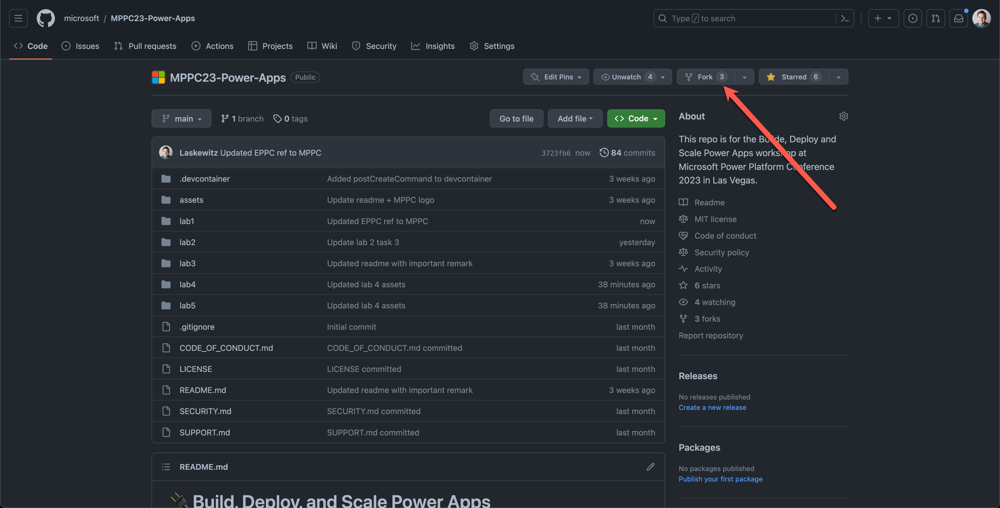
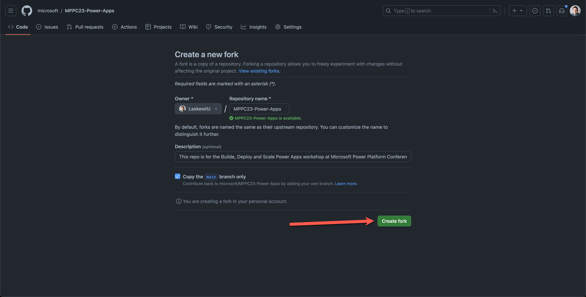

## Create a fork of the repository for this workshop

A fork is a copy of an existing repository. Forking a repository allows you to freely experiment with changes without affecting the original project.

1. Go to the [PPC24-ALM](https://aka.ms/PPCC24-ALM) GitHub repository
1. Click on the **Fork** button on the top right corner

    

1. Once the "Create a new fork" page opens, review the information and then click **Create Fork**

    

    Once your have created the fork, you will be redirected to your forked repository. You can see that you are in your forked repository by looking at the top left corner of the page. It should say **PPCC24-ALM forked from microsoft/PPCC24-ALM**.